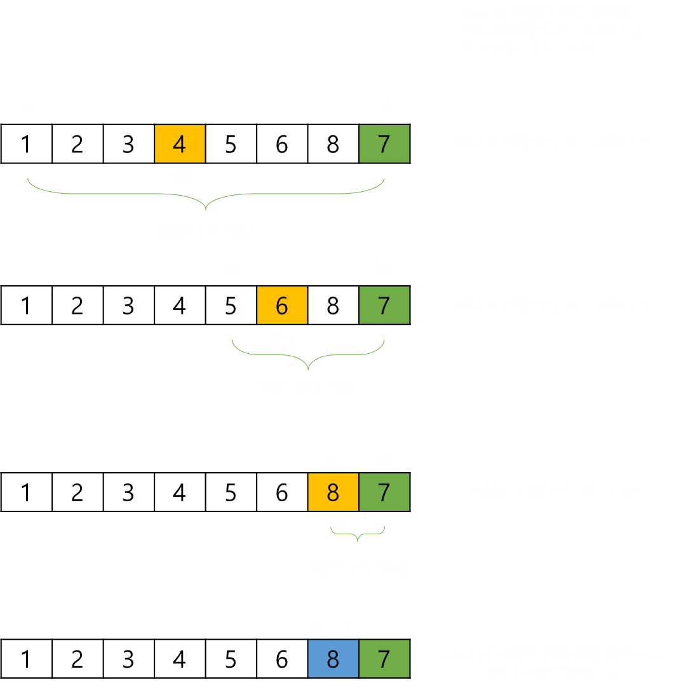
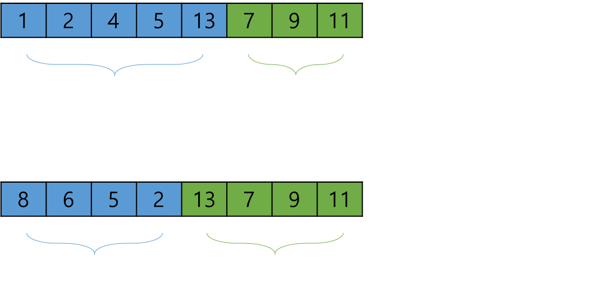

# Binary Insertion, 이진 삽입 정렬

> 이진 삽입 정렬을 학습하기 전에 삽입 정렬에 대한 이해가 필요하다.   
> <a href="https://github.com/jeongwon201/sort-algorithm/tree/main/src/main/java/com/sortalgorithm/insertion">삽입 정렬</a>

**이진 삽입 정렬** 이란, 삽입 정렬에 이분(이진) 탐색을 결합한 알고리즘이다.   
 

삽입 정렬은 원소가 들어갈 위치를 선형 탐색을 이용하지만,   
이진 삽입 정렬에서는 원소가 들어 갈 위치를 이분 탐색을 이용한 방법으로 구현한다.

> **이분(이진) 탐색이란 ?**   
> 리스트에서 탐색 범위를 절반씩 좁혀가면서 탐색하는 방법을 말한다.
> 
> 

>    
>     
> 

 
 
 
 

## 알고리즘
> 모든 알고리즘은 오름차순을 기준으로 설명합니다.

 

전체적인 알고리즘은 삽입 정렬과 같다.   
그러나 원소가 들어갈 위치를 찾을 때, 이분 탐색을 이용한다.
 

이분 탐색으로 원소가 들어갈 위치를 찾는 과정은 다음과 같다.

 
 

   
    

 
 

한 가지 더 추가할 부분이 있다면, 삽입 정렬에서 최선의 경우 O(N)의 시간 복잡도를 가진다.   
그러나 이진 탐색 정렬은 이미 정렬되어 있어도 항상 이분 탐색을 진행하기에,   
최선의 경우에서도 O(logN * N) = O(NlogN)의 시간 복잡도를 가지게 된다.   
 

이러한 단점을 보완하기 위해서, 미리 리스트의 정렬된 부분을 확인해야 한다.   
 
 

   
    

 
 

 
 
 
 

## 시간 복잡도
이진 삽입 정렬의 시간 복잡도는 다음과 같다.
> - 최악: **O(n²)**
> - 최선: **O(n)**
> - 평균: **O(n²)**

 
 

이진 삽입 정렬의 시간 복잡도는 삽입 정렬과 동일하다.   
 

원소가 들어갈 위치를 탐색하는 과정을 이분 탐색으로 이용하여 logN 의 시간으로   
단축했음에도 불구하고, O(n²)의 시간 복잡도를 가지는 이유는 **교체 비용** 때문이다.
 

그리고 미리 정렬된 리스트의 부분을 확인하지 않으면 정렬된 부분을 이분 탐색해야하므로,   
삽입 정렬이 가지는 장점인 최상의 경우에서 O(N)의 시간 복잡도를 기대할 수 없다.
 
 
 
 

## 특징

이진 삽입 정렬은 데이터를 비교하면서 정렬하기 때문에 **비교 정렬**이며,   
정렬 대상 외 추가적인 공간을 필요로 하지 않기 때문에 **제자리 정렬**이다.   
내림차순을 오름차순으로 변경하는 것만 제외한다면 **안정 정렬**이 가능하다.
 

> - **비교 정렬**
> - **제자리 정렬**
> - **안정 정렬** 또는 **불안정 정렬**
 

이진 삽입 정렬이 항상 삽입 정렬보다 빠른 것은 아니다.   
만약 리스트가 정렬된 부분 리스트 - 정렬되지 않은 부분 리스트 - 정렬된 부분 리스트로 이루어져있다면,   
삽입 정렬이 더 빠른 속도를 보일 수도 있다.   
 

그래도 이진 삽입 정렬은 O(n²) 정렬 중 빠른 편에 속한다.
