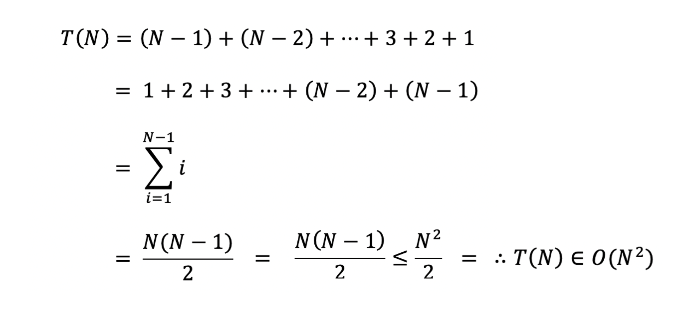

# Bubble Sort, 버블 정렬

**버블 정렬** 또는 **거품 정렬**은 정렬 알고리즘 중 하나로, 서로 인접한 두 원소를 비교하여 정렬하는 알고리즘이다.   
속도가 상당히 느리지만 코드가 단순하기 때문에 자주 사용된다.   
 

원소의 이동이 수면으로 올라오는 거품과 비슷한 모습을 보이기에 지어진 이름이다.   
이를 양방향으로 번갈아 수행하면 <a href="">칵테일 정렬</a>이 된다.
 
 
 
 

## 알고리즘
> 모든 알고리즘은 오름차순을 기준으로 설명합니다.

 

버블 정렬은 서로 인접한 두 원소를 비교하여 두 원소가 정렬되어있지 않다면 서로를 교환하고,   
정렬되어있다면 교환하지 않고 다음 두 원소를 비교하는 과정을 반복한다.
 
 

    

 
 
 
 

## 시간 복잡도
버블 정렬의 시간 복잡도는 다음과 같다.
> - 최악: **O(n²)**
> - 최선: **O(n)**
> - 평균: **O(n²)**

 
 

최악의 경우 시간 복잡도 산출의 과정은 다음과 같다.

    

 
 

최선의 경우 리스트를 한 번 순회하는 것으로 끝나기에 **O(n)** 의 시간 복잡도를 가진다.
 

**평균의 경우** 최악의 경우와 최선의 경우를 더한 뒤 2로 나누어준다.   
O( (n + n²)/2 ) 은 상한선에 의해 결국 O(n²)이므로, 시간 복잡도는 **O(n²)** 이다.
 
 
 
 

## 특징
버블 정렬은 데이터를 비교하면서 정렬하기 때문에 **비교 정렬**이며,   
정렬 대상 외 추가적인 공간을 필요로 하지 않기 때문에 **제자리 정렬**이다.   
그리고 데이터를 앞에서부터 차례대로 비교하면서 정렬하기 때문에 **안정 정렬**이다.
 

> - **비교 정렬**
> - **제자리 정렬**
> - **안정 정렬**

삽입 정렬이나 선택 정렬과 같은 O(n²)의 시간 복잡도를 가지지만,   
버블 정렬의 교환 횟수가 평균적으로 더 많아 삽입, 선택 정렬보다 더 많은 시간이 걸린다.  