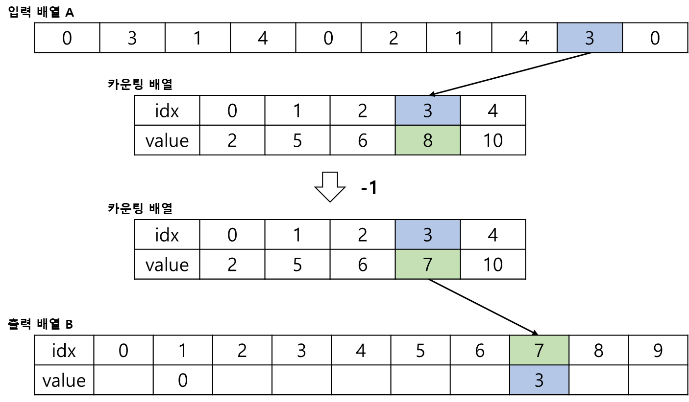
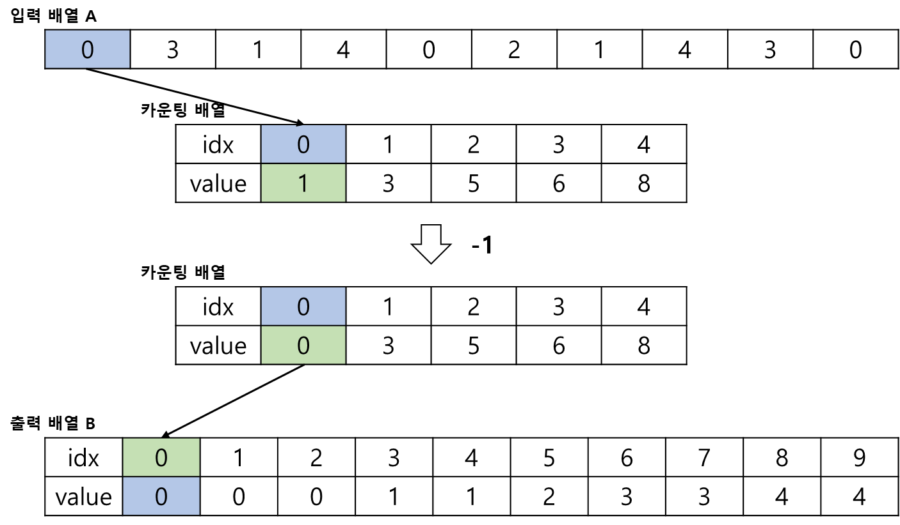

# Counting Sort, 카운팅 정렬

Counting Sort 란, 배열의 두 값을 서로 비교하지 않고 정렬을 수행하는 정렬 알고리즘이다.

## 정렬 과정
입력 배열 A가 있을 때, A 배열의 요소 중 최댓값 + 1 의 길이를 가지는 카운팅 배열을 생성한다.

 

A 배열을 순회하면서 값에 해당하는 카운팅 배열의 인덱스에 1 씩 증가시킨다.

 

카운팅 배열의 요소에 직전 요소의 값을 더한다.

 

A 배열과 동일한 길이의 출력 배열 B 를 생성 후 A 배열의 역순으로 B 배열의 요소를 채워준다.

.  
.  
.  

## 시간 복잡도
알고리즘 과정을 보면 모든 경우의 시간복잡도가 <strong>O(n)</strong> 이므로, 카운팅 정렬의 시간 복잡도는 <strong>O(n)</strong> 이다.
 - 최댓값이 주어지지 않을 경우 입력 배열을 탐색하는 시간 복잡도 <strong>O(n)</strong>
 - 카운팅 배열에 등장 횟수를 입력하기 위해 탐색하는 시간 복잡도 <strong>O(n)</strong>
 - 이후 출력 배열에 정렬된 배열을 저장하는 시간 복잡도 <strong>O(n)</strong>

그러나 배열의 길이에 상관없이 배열의 최댓값 K가 정렬 시간의 변수로 작용한다. 

예를 들어 배열의 길이는 작은데 최댓값이 매우 클 경우, 정렬 시간은 그만큼 길어진다.
이는 시간 복잡도가 배열의 최댓값 K에 종속된다는 것을 의미한다.

그러므로 일반적으로 카운팅 정렬의 시간 복잡도는 <strong>O(n + k)</strong> 라고 말한다.

카운팅 정렬은 배열의 최댓값이 작을 경우 상당히 유리하다.