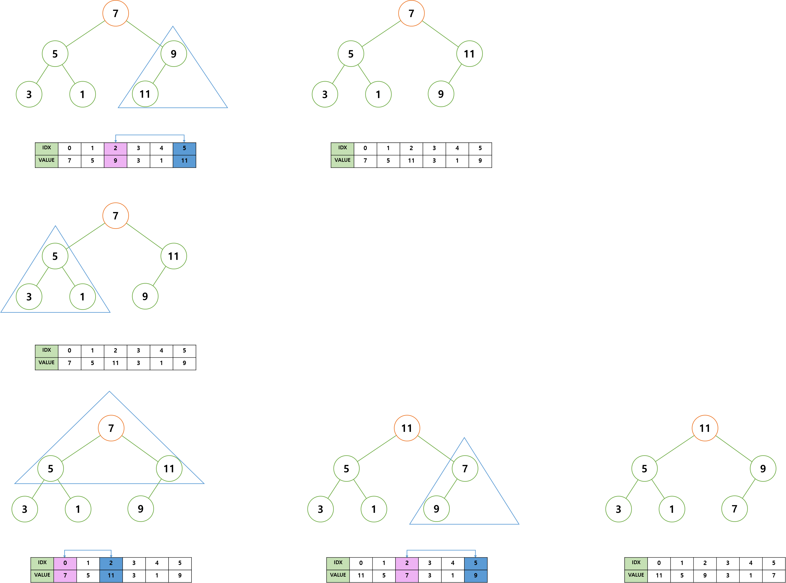

# Heap Sort, 힙 정렬

> 힙 정렬을 학습하기 전에 힙 자료 구조에 대한 이해가 필요하다.   
> <a href="https://github.com/jeongwon201/data-structure/blob/main/src/main/java/com/datastructure/heap/Heap.md">힙 자료구조</a>

힙 정렬이란, 배열을 최대 또는 최소 힙으로 구성하여 정렬하는 정렬 알고리즘을 말한다.   
 

오름차순 힙 정렬 과정을 간단하게 설명하자면 다음과 같다.   
- 배열을 최대 힙으로 구성
- 루트 노드를 배열의 마지막으로 이동
 

정렬이 완료될 때 까지 위 과정을 반복한다.
 
 

내림차순 힙 정렬은 위 과정을 최대 힙이 아닌 최소 힙으로 구성하면 된다.   
 

## 정렬 과정

가장 먼저 배열을 최대 힙으로 구성한다.   
 

최대 힙을 구성하는 과정에서, 재귀 호출이 사용된다.   
그러나 재귀 호출은 스택 오버 플로우의 위험성과 효율성을 저하시키기 때문에, 반복문으로 구현한다.
 

최대 힙을 구성하기 위해 새로운 배열을 생성하는 것은 불필요한 메모리 낭비이기에,   
기존 배열에서 최대 힙을 구성한다.
> 필자가 올린 힙 자료 구조의 인덱스 공식과 힙 정렬의 인덱스 공식에는 차이가 있다.   
>  
> 
> 힙 자료 구조에서는 시작 인덱스가 1인 반면에,   
> 힙 정렬에서는 배열을 그대로 이용하기에 시작 인덱스가 0이므로, 공식은 다음과 같다.
>  
> 
> - 왼쪽 자식 노드 인덱스 = 부모 노드 인덱스 * 2 + 1
> - 오른쪽 자식 노드 인덱스 = 부모 노드 인덱스 * 2 + 2
> - 부모 노드 인덱스 = 자식 노드 인덱스 - 1 / 2

 
 

    
     

 
 

마지막 과정에서, 데이터의 교환 후 자식 노드의 서브 트리가 최대 힙의 조건을 만족하지 않는다.   
그러므로 데이터 교환 후 자식 노드의 서브 트리가 최대 힙의 조건을 만족하는지 확인해야한다.   
 
 

배열을 최대 힙으로 구성하였다면, 루트 노드의 값을 배열의 마지막으로 옮긴다.   
위 과정을 정렬이 될 때 까지 반복한다.   
 

    
     

 
 

## 시간 복잡도
시간 복잡도는 최악 또는 최상의 경우 모두 O(NlogN) 이다.   
그리고 힙의 특성상 최대 또는 최소 값만을 가지고 정렬을 수행하기 때문에, 불안정 정렬이다.   
 

일반적인 정렬에 비해 비효율적이지만, 부분 정렬에 있어서는 효율적이다.