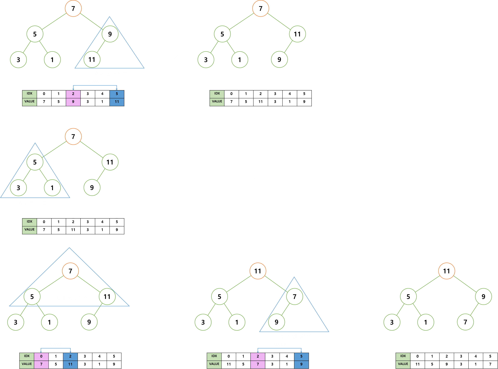
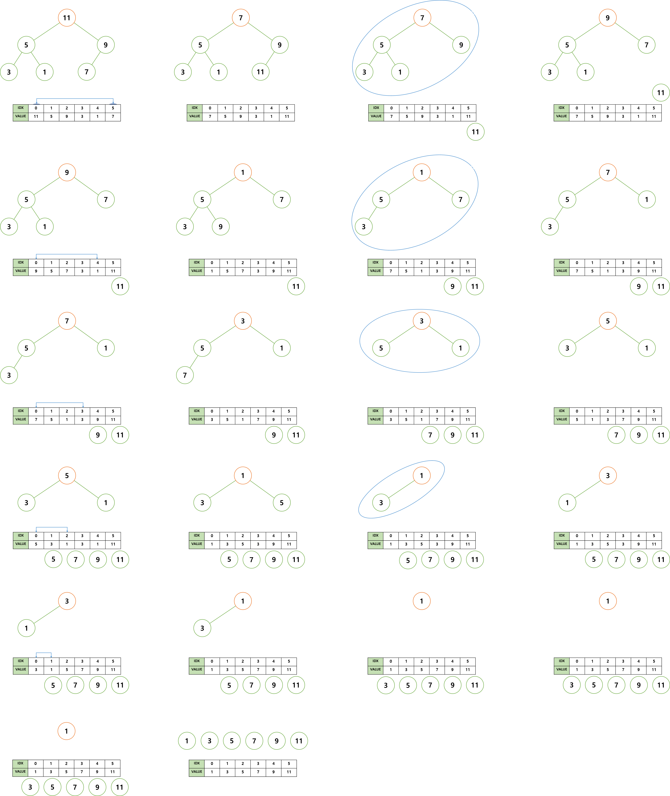

# Heap Sort, 힙 정렬

> 힙 정렬을 학습하기 전에 힙 자료 구조에 대한 이해가 필요하다.   
> <a href="https://github.com/jeongwon201/data-structure/blob/main/src/main/java/com/datastructure/heap/Heap.md">힙 자료구조</a>

**힙 정렬**이란, 배열을 최대 또는 최소 힙으로 구성하여 정렬하는 정렬 알고리즘을 말한다.   
내림차순 정렬은 최소 힙으로 구성하고, 오름차순 정렬은 최대 힙으로 구성한다.   
 
 
 
 

## 알고리즘
> 모든 알고리즘은 오름차순을 기준으로 설명합니다.

 

가장 먼저 배열을 최대 힙으로 구성한다.   
 

최대 힙을 구성하는 과정에서, 재귀 호출이 사용된다.   
그러나 재귀 호출은 스택 오버 플로우의 위험성과 효율성을 저하시키기 때문에, 반복문으로 구현한다.
 

최대 힙을 구성하기 위해 새로운 배열을 생성하는 것은 불필요한 메모리 낭비이기에,   
기존 배열에서 최대 힙을 구성한다.
> 위 힙 자료 구조 링크의 인덱스 공식과 힙 정렬의 인덱스 공식에는 차이가 있다.   
>  
> 
> 힙 자료 구조에서는 시작 인덱스가 1인 반면에,   
> 힙 정렬에서는 배열을 그대로 이용하기에 시작 인덱스가 0이므로, 공식은 다음과 같다.
>  
> 
> - 왼쪽 자식 노드 인덱스 = 부모 노드 인덱스 * 2 + 1
> - 오른쪽 자식 노드 인덱스 = 부모 노드 인덱스 * 2 + 2
> - 부모 노드 인덱스 = 자식 노드 인덱스 - 1 / 2

 
 

    
     

 
 

마지막 과정에서, 데이터의 교환 후 자식 노드의 서브 트리가 최대 힙의 조건을 만족하지 않는다.   
그러므로 데이터 교환 후 자식 노드의 서브 트리가 최대 힙의 조건을 만족하는지 확인해야한다.   
 
 

배열을 최대 힙으로 구성하였다면, 루트 노드의 값을 배열의 마지막으로 옮긴다.   
위 과정을 정렬이 될 때 까지 반복한다.   
 

    
     

 
 
 
 

## 시간 복잡도
힙 정렬의 시간 복잡도는 다음과 같다.
> 모든 경우에서 **O(NlogN)**

배열을 최대 또는 최소 힙으로 만드는 과정에서 **O(n)**,   
원소 하나를 정렬하는 과정에서 **O(log₂n)** 의 시간복잡도를 가지며,   
모든 원소가 위 과정을 수행하므로 정렬 과정에서 **O(nlog₂n)** 의 시간 복잡도를 가진다.
 

최대 또는 최소 힙으로 만드는 과정의 시간 복잡도와 모든 원소를 정렬 과정의 시간 복잡도를 합한다.   
O(n) + O(nlog₂n) = O(n + nlog₂n) = **O(NlogN)**
 
 
 
 

## 특징
힙 정렬은 불안정 정렬인 최대, 최소 힙에서 최대, 최소 값만 이용하여 정렬하기에 **비교 정렬** 아니며, **불안정 정렬**이다.
그리고 정렬 대상 외 추가적인 공간을 필요로 하지 않기 때문에 **제자리 정렬**이다.   
 

> - **불안정 정렬**
> - **제자리 정렬**
 
 
일반적인 **O(NlogN)** 정렬 알고리즘에 비해 성능은 약간 떨어지지만,   
부분 정렬에 있어서는 강력한 알고리즘이다.