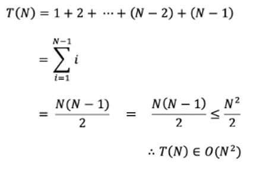

# Insertion Sort, 삽입 정렬

**삽입 정렬**은 모든 요소를 앞에서부터 차례대로 이미 정렬된 배열 부분과 비교하여,   
자신의 위치를 찾아 삽입함으로써 정렬을 완성하는 알고리즘이다.
 
 
 
 

## 알고리즘
> 모든 알고리즘은 오름차순을 기준으로 설명합니다.

 

입력 배열의 모든 요소를 차례대로 이미 정렬된 배열 부분과 비교하여, 자신의 위치를 찾아 삽입한다.   
위에서 말하는 이미 정렬된 배열 부분이란, 정렬하려는 요소의 이전 요소들을 의미한다.
 
 

    

 
 
 
 

## 시간 복잡도
삽입 정렬의 시간 복잡도는 다음과 같다.
> - 최악: **O(n²)**
> - 최선: **O(n)**
> - 평균: **O(n²)**

 
 

**최악의 경우** 시간 복잡도 산출 과정이다.

    

 
 

최선의 경우 리스트를 한 번 순회하는 것으로 끝나기에 **O(n)** 의 시간 복잡도를 가진다.
 

**평균의 경우** 최악의 경우와 최선의 경우를 더한 뒤 2로 나누어준다.   
O( (n + n²)/2 ) 은 상한선에 의해 결국 O(n²)이므로, 시간 복잡도는 **O(n²)** 이다.
 
 
 
 

## 특징
삽입 정렬은 데이터를 비교하면서 정렬하기 때문에 **비교 정렬**이며,   
정렬 대상 외 추가적인 공간을 필요로 하지 않기 때문에 **제자리 정렬**이다.   
그리고 데이터를 앞에서부터 차례대로 비교하면서 정렬하기 때문에 **안정 정렬**이다.
 

> - **비교 정렬**
> - **제자리 정렬**
> - **안정 정렬**
 

메모리 소비가 작고 거의 정렬된 경우 매우 효율적이지만,   
데이터의 상태에 따라 성능 편차가 매우 크다.