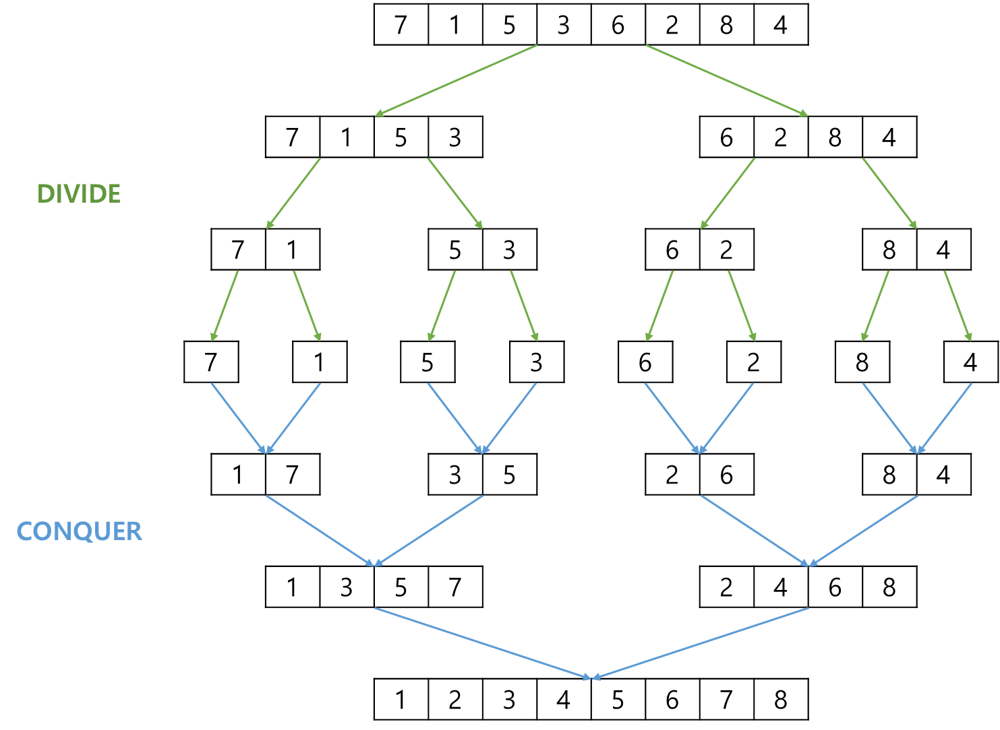
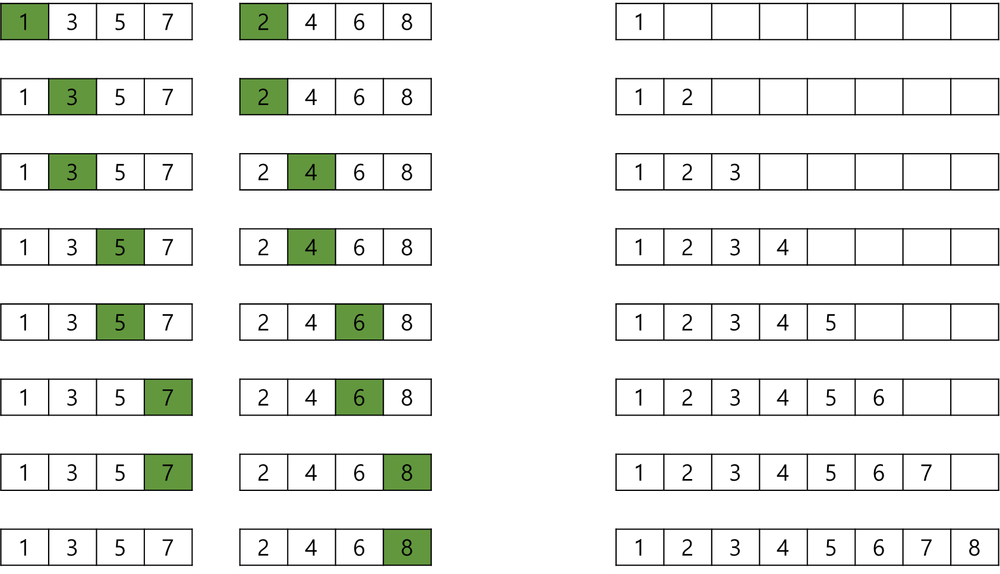

# Merge Sort, 합병(병합) 정렬

합병 정렬이란, 분할 정복 알고리즘으로 정렬하는 기법이다.   
 

> **분할 정복 알고리즘이란?**
> 해결할 수 없는 문제를 작은 문제로 분할하여 해결하는 알고리즘을 말한다.
> 분할 정복 알고리즘은 보통 재귀 함수를 통해 자연스럽게 구현된다.

구체적으로 설명하면, 리스트를 잘게 쪼개어 생성된 부분 리스트에서 인접한 원소를 비교하여   
정렬하면서 리스트를 합쳐나가는 방식이다.   
 

## 정렬 과정
합병 정렬의 전체적인 과정은 다음과 같다.
 
 

    
     

 
 

먼저 정렬할 리스트를 잘게 쪼갠다.
 

리스트를 잘게 쪼개어 여러 부분 리스트가 되었다면,   
다음은 부분 리스트를 서로 비교하면서 오름차순 기준 작은 값 부터 하나씩 합쳐나간다.
 

이 때 중요한 부분이 **작은 값 부터 하나씩 합쳐나간다**는 부분이다.   
두 리스트를 이어 하나의 리스트로 합친 후 정렬을 하는 것이 아닌, 정렬을 하면서 합병한다.
 

합병 과정은 다음과 같다.
 
 

    
     

 
 

부분 리스트의 가장 앞 원소부터 하나씩 비교하면서 리스트를 채워나가는 방식이다.
 
 

위에서 설명한 합병 정렬처럼   
리스트를 더 이상 나눌 수 없을 때 까지 두 개로 쪼개어 합병하는 방식을,   
**2-way 합병 정렬**이라고 부른다.
 

합병 정렬이 보통 재귀 함수로 자연스럽게 구현되는 분할 정복 알고리즘에 기반하기 때문에, 재귀 함수로 구현할 수 있다.   
그러나 정렬 알고리즘에서는 성능을 위해 재귀 함수를 사용하지 않는다.   
 

코드에서는 재귀 함수를 이용한 방식과 재귀 함수를 이용하지 않는 방식을 모두 구현한다.

### 시간 복잡도

시간 복잡도는 최상 또는 최악의 경우 모두 **O(NlogN)** 으로 동일하다.
 

정렬 과정에서 추가적인 배열을 이용하기 때문에 메모리 사용량이 증가하고,   
보조 배열에서 원본 배열로 복사하는 과정에서 많은 시간이 소요된다.
