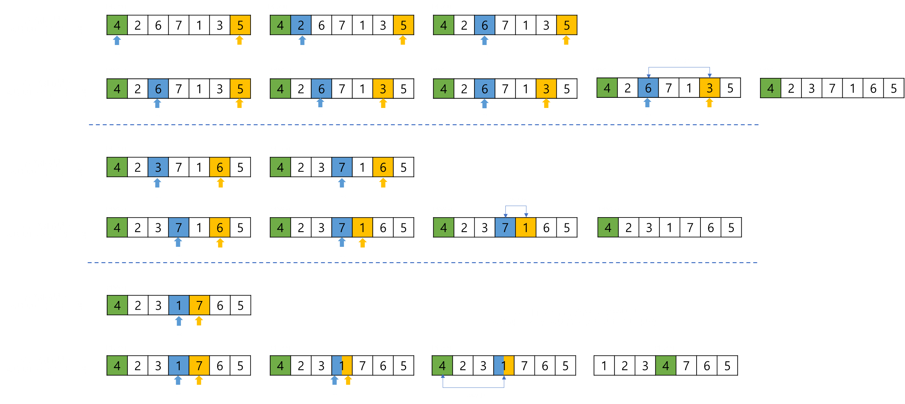
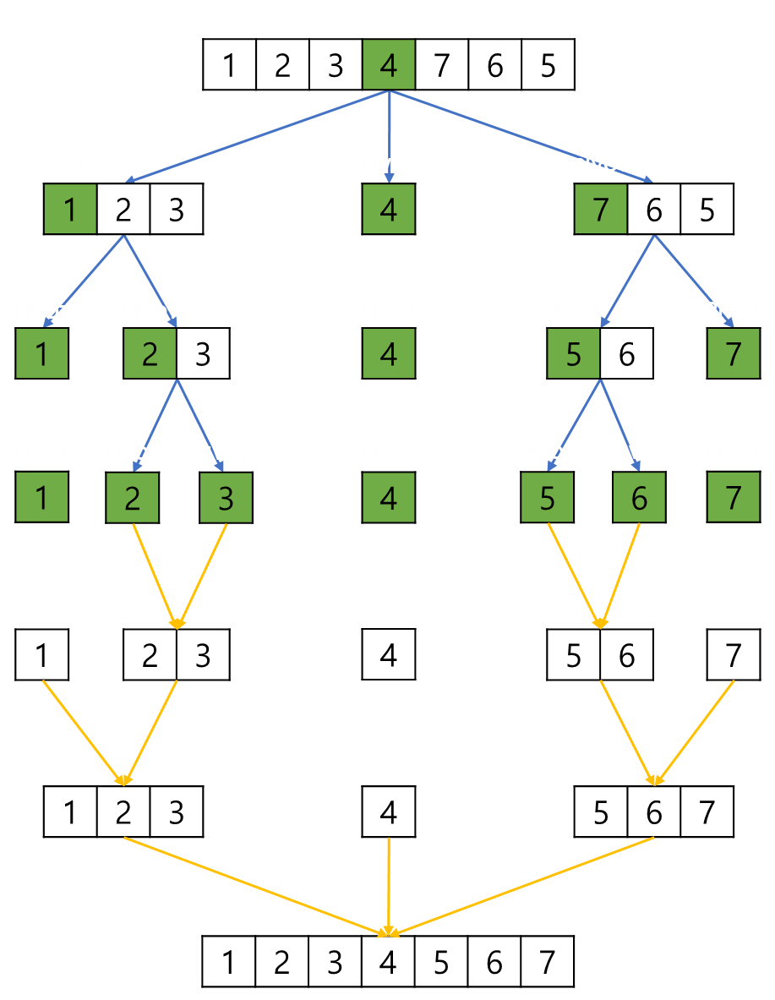

# Quick Sort, 퀵 정렬

**퀵 정렬**이란, 피벗을 기준으로 분할 정복 알고리즘을 사용하여 정렬하는 정렬 알고리즘이다.   
 
 
 
 

## 알고리즘
> 모든 알고리즘은 오름차순을 기준으로 설명합니다.

 

퀵 정렬의 과정은 다음과 같다.   
 

리스트에서 하나의 원소를 선택한다. 선택한 원소를 피벗(pivot)이라고 한다.   
리스트에서 피벗을 기준으로 왼쪽은 피벗보다 작은 값, 오른쪽은 피벗보다 큰 값이 오도록 정렬 후,   
피벗을 기준으로 리스트를 두 개의 부분 리스트로 나눈다.   
두 개의 부분 리스트에 대해 재귀적으로 위 과정을 반복한다.   
이후 잘게 쪼개어진 부분 리스트를 병합한다.
 
 

다음은 피벗을 가장 왼쪽으로 선택하는 퀵 정렬이다.
 
 

    
     

 
 

위 그림에서 볼 수 있듯이 왼쪽에서부터 증가하는 인덱스(파란색)를 **lo**,   
오른쪽에서부터 감소하는 인덱스(노란색)를 **hi** 라고하여, 이 두 인덱스를 이용한다.
 

lo 부터 인덱스를 하나씩 증가시키면서 **lo < hi** 조건을 만족하고 **피벗보다 큰 값**을 찾는다.   
 

lo < hi 조건을 만족하고 피벗보다 큰 값을 찾았다면,   
다음은 hi 의 인덱스를 하나씩 감소시키면서 **lo < hi** 조건을 만족하고 **피벗보다 작은 값**을 찾는다.   
 

lo 와 hi 를 모두 찾았다면, 이 두 값을 교환한다.   
 

이 과정을 반복하면, lo 와 hi 가 만나는 지점이 생기게 된다.   
즉, lo와 hi가 같아져 lo < hi 조건을 만족하지 않는 지점이 생긴다.   
이 때 해당 지점과 피벗을 교환한다.   
그러면 피벗의 왼쪽에는 피벗보다 작은 값, 오른쪽에는 피벗보다 큰 값이 위치하게 된다.   
 

이제 피벗을 기준으로 리스트를 나눈다.   
그림에서는 이해를 돕기위해 피벗을 기준으로 정렬하는 과정을 생략하고 리스트를 분할하는 과정만 표현한다.   
 
 

    
     

 
 

피벗을 기준으로 리스트를 나눈 뒤 생성되는 두 부분 리스트에 대해서도,   
피벗을 가장 왼쪽으로 하여 앞서 했던 정렬 과정을 반복하면 된다.   
 

재귀 함수를 이용하여 더 이상 리스트를 분할할 수 없을 때,   
부분 리스트를 병합하면서 정렬된 리스트를 얻을 수 있다.
 
 
 
 

## 시간 복잡도
퀵 정렬의 시간 복잡도는 다음과 같다.
> - 최악: **O(n²)**
> - 최선: **O(NlogN)**
> - 평균: **O(NlogN)**

 
 

최선, 평균일 경우 **O(NlogN)** 인 이유는 다음과 같다.   
리스트를 1 개 까지 쪼개어 보면 이진 트리의 구조를 가진다.   
n개의 노드에 대한 이진 트리의 높이는 O(logN)이며, partition 과정에서는 O(N) 만큼의 시간이 소요된다.
이진 트리의 높이 만큼 partition 이 수행되므로 O(logN) * O(N) = O(logN * N) = **O(NlogN)**
 

퀵 정렬은 특정한 조건에 의해 O(n²)의 시간 복잡도를 보인다.   
10개의 원소를 가지는 리스트 분할을 1개와 나머지 원소로 분할하는 상황을 말한다.   
이름부터 대놓고 빠른 알고리즘이라고 말하는데, 버블 정렬과 같은 시간 복잡도를 보인다.   
 

이러한 단점을 극복하기위해 **Median-Of-3 method**을 도입하게 되었다.   
**Median-Of-3 method** 이란 배열에서 처음, 중간, 마지막 원소 중 리스트의 중앙 부분을   
분할하는 원소를 가장 왼쪽으로 옮긴 후 이 원소를 피벗으로 설정하는 것이다.
 

위 방법으로 정렬 시 평균적으로 **O(NlogN)** 의 시간 복잡도를 유지할 수 있다고 한다.
 
 

## 특징
퀵 정렬은 데이터를 비교하면서 정렬하기 때문에 **비교 정렬**이며,   
정렬 대상 외 추가적인 공간을 필요로 하지 않기 때문에 **제자리 정렬**이다.   
피벗을 이용해 리스트를 분할하여 서로 거리가 먼 원소끼리 교환이 일어나기 때문에 **불안정 정렬**이다.
 

> - **비교 정렬**
> - **제자리 정렬**
> - **불안정 정렬**