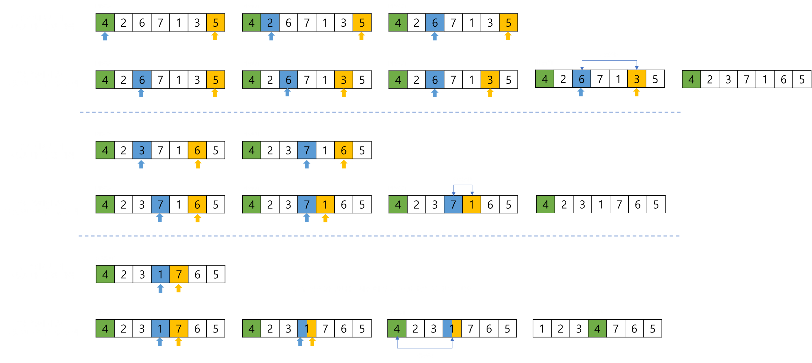

# Quick Sort, 퀵 정렬

퀵 정렬이란, 피벗을 기준으로 분할 정복 알고리즘을 사용하여 정렬하는 정렬 알고리즘이다.   
 

퀵 정렬의 과정은 다음과 같다.   
 

리스트에서 하나의 원소를 선택한다. 선택한 원소를 피벗(pivot)이라고 한다.   
리스트에서 피벗을 기준으로 왼쪽은 피벗보다 작은 값, 오른쪽은 피벗보다 큰 값이 오도록 정렬 후,   
피벗을 기준으로 리스트를 두 개의 부분 리스트로 나눈다.   
두 개의 부분 리스트에 대해 재귀적으로 위 과정을 반복한다.   
이후 잘게 쪼개어진 부분 리스트를 병합한다.
 

피벗을 선택하는 방법은 여러 가지가 있는데, 대표적으로 세 가지 방법이 있다.
- 리스트의 가장 왼쪽 원소
- 리스트의 가장 오른쪽 원소
- 리스트의 중간 원소
 

## 정렬 과정

### 리스트의 가장 왼쪽 원소를 피벗으로 선택
피벗이 가장 왼쪽에 있다면, 어떻게 피벗을 기준으로 왼쪽에는 피벗보다 작은 값을 옮길 수 있을까?   
 
 

    
     

 
 

위 그림에서 볼 수 있듯이 왼쪽에서부터 증가하는 인덱스(파란색)를 **lo**,   
오른쪽에서부터 감소하는 인덱스(노란색)를 **hi** 라고하여 이 두 인덱스를 이용한다.
 

lo 부터 인덱스를 하나씩 증가시키면서 **lo < hi** 조건을 만족하고 **피벗보다 큰 값**을 찾는다.   
 

lo < hi 조건을 만족하고 피벗보다 큰 값을 찾았다면,   
다음은 hi 의 인덱스를 하나씩 감소시키면서 **lo < hi** 조건을 만족하고 **피벗보다 작은 값**을 찾는다.   
 

lo 와 hi 를 모두 찾았다면, 이 두 값을 교환한다.   
 

이 과정을 반복하면, lo 와 hi 가 만나는 지점이 생기게 된다.   
즉, lo와 hi가 같아져 lo < hi 조건을 만족하지 않는 지점이 생긴다.   
이 때 해당 지점과 피벗을 교환한다.   
그러면 피벗의 왼쪽에는 피벗보다 작은 값, 오른쪽에는 피벗보다 큰 값이 위치하게 된다.   
 

이제 피벗을 기준으로 리스트를 나눈다.   
그림에서는 이해를 돕기위해 피벗을 기준으로 정렬하는 과정을 생략하고 리스트를 분할하는 과정만 표현한다.   
 
 

    
     

 
 

피벗을 기준으로 리스트를 나눈 뒤 생성되는 두 부분 리스트에 대해서도,   
피벗을 가장 왼쪽으로 하여 앞서 했던 정렬 과정을 반복하면 된다.   
 

재귀 함수를 이용하여 더 이상 리스트를 분할할 수 없을 때,   
부분 리스트를 병합하면서 정렬된 리스트를 얻을 수 있다.
 
 

### 리스트의 가장 오른쪽 원소를 피벗으로 선택
피벗을 리스트의 가장 오른쪽 원소로 선택하는 경우는 왼쪽으로 선택하였을 경우와 동일하다.   
피벗을 가장 오른쪽 원소로 설정하기만 하면 되므로 설명은 생략한다.
 
 

### 리스트의 중간 원소를 피벗으로 선택
