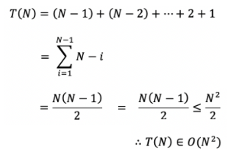

# Selection Sort, 선택 정렬

**선택 정렬** 이란, 현재 위치에 맞는 데이터를 선택하여 정렬을 수행하는 정렬 알고리즘이다.   
 
 
 
 

## 알고리즘
> 모든 알고리즘은 오름차순을 기준으로 설명합니다.

 

입력 배열에서 최소 값을 탐색 후, 가장 앞의 요소와 교환한다.   
가장 앞의 위치를 제외한 나머지 배열에 위와 같은 방법으로 교환을 수행한다.
 
 

    

 
 
 
 

## 시간 복잡도
선택 정렬의 시간 복잡도는 다음과 같다.
> 모든 경우에서 **O(n²)**

 
 

시간 복잡도 산출의 과정은 다음과 같다.

    

 
 
 
 

## 특징
선택 정렬은 데이터를 비교하면서 정렬하기 때문에 **비교 정렬**이며,   
정렬 대상 외 추가적인 공간을 필요로 하지 않기 때문에 **제자리 정렬**이다.   
동일한 값의 순서가 수시로 변할 수 있기 때문에 **불안정 정렬**이다.
 

> - **비교 정렬**
> - **제자리 정렬**
> - **불안정 정렬**

 

메모리 소비가 작지만, 성능 상 좋은 알고리즘은 아니다.