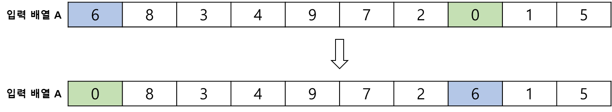
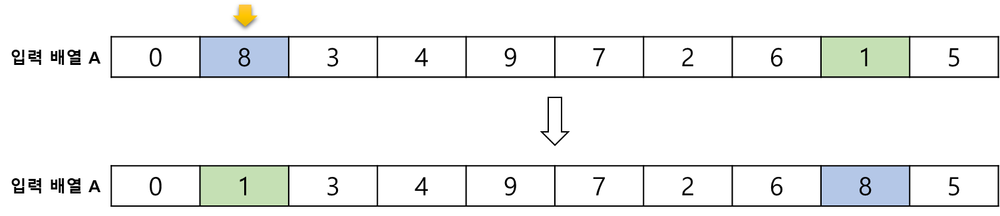
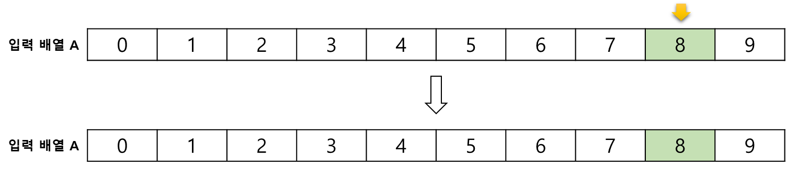

# Selection Sort, 선택 정렬

**Selection Sort** 란, 현재 위치에 맞는 데이터를 선택하여 정렬을 수행하는 정렬 알고리즘이다.   
데이터를 비교하면서 정렬을 수행하기 때문에, 추가적인 공간 할당이 필요없어 **제자리 정렬 알고리즘** 이다.

## 정렬 과정
주어진 입력 배열에서 최소 값을 찾아 제일 앞 자리 요소와 교환한다.

 

제일 앞 자리를 제외한 나머지 값들 중 차례대로 최소 값을 찾아 위치를 교환하는 행위를 반복한다.

.  
.  
.  

 

앞 인덱스부터 순서대로 최소 값을 찾아 교환하기 때문에 배열의 마지막 인덱스는 최대값이 오게되므로, 마지막 인덱스를 참조할 필요가 없다.

## 시간 복잡도
알고리즘 과정을 보면 최소 값을 찾기 위해 반복적으로 배열을 탐색한다.
- 배열 A의 길이 = 5
  - idx = 0 일 때 4 번 순회
  - idx = 1 일 때 3 번 순회
  - idx = 2 일 때 2 번 순회
  - idx = 3 일 때 1 번 순회   

(N-1) + (N-2) + (N-3)... + 1 = N(N-1)/2, 즉 시간 복잡도는 **O(n²)** 이다.

선택 정렬은 버블 정렬보다 시간 복잡도는 동일하지만 항상 우수하다.   
순회할 수록 순회해야할 횟수가 줄어들기 때문이다.

그러나 같은 값이 있을 때, 이 값 들의 순서를 보장하기 어렵다는 단점이 있다.   
그러므로, 선택 정렬은 **불안정 정렬**이다.