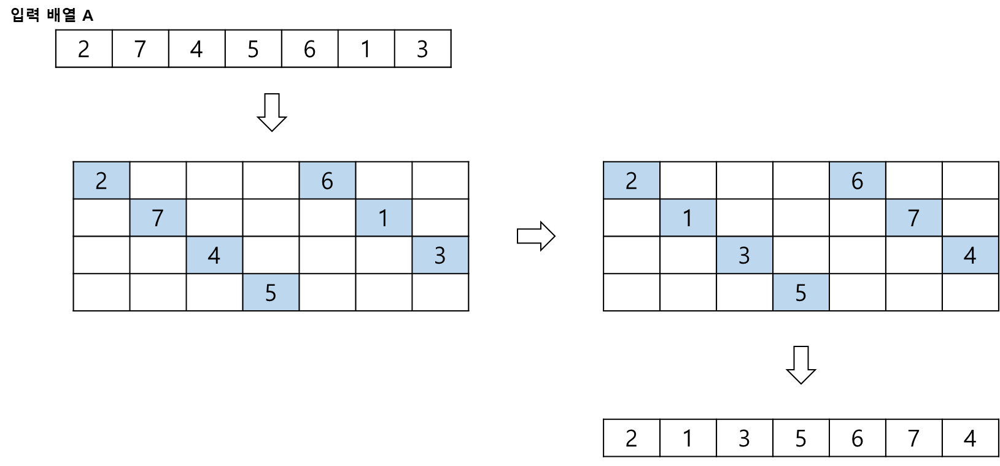
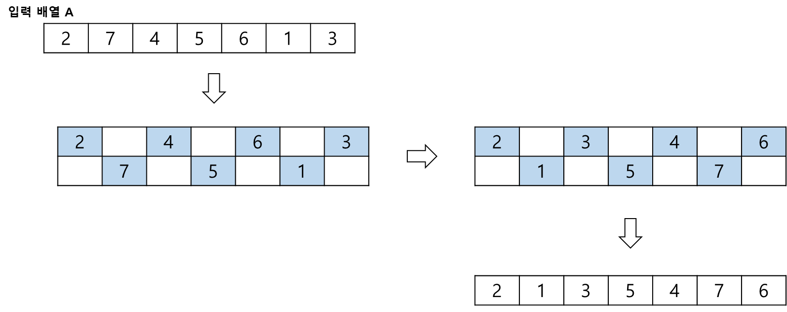
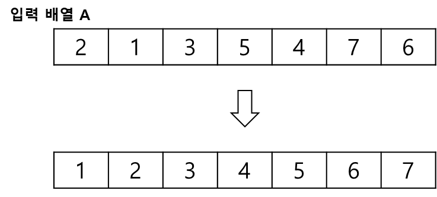

# Shell Sort, 쉘 정렬

**쉘 정렬** 이란, 삽입 정렬을 기반으로하여 삽입 정렬의 장점을 유지하면서 단점을 최소화하는 정렬 알고리즘이다.   
삽입 정렬은 이미 정렬되어있는 경우 매우 효율적이지만, 반대의 경우 매우 비효율적인 알고리즘이다.   
 

쉘 정렬은 이러한 삽입 정렬의 단점을 보완하여, 정렬 대상을 간격을 두어 삽입 정렬을 반복한다.   
이 때, 간격을 계속 줄여나가면서 최종으로 간격이 1이 될 때까지 삽입 정렬을 반복하면 최종적으로 정렬된 상태를 얻을 수 있다.   
 

그렇다면 간격을 어떻게 설정할까?   
간격이 너무 좁거나 넓으면, 속도나 오버헤드가 늘어나 쉘 정렬을 사용하는 의미가 없다.   
그러므로 적당한 간격을 설정해야 하는데, 이 간격은 여러 가지가 존재하며, 이를 갭 시퀀스(Gap Sequence)라고 한다.

가장 많이 사용되는 갭 시퀀스는 다음과 같다.   
A003462(Knuth Sequence)   
A108870(Tokuda Sequence)   
A102549(Ciura Sequence)   

이 중 경험을 바탕으로하는 Ciura Sequence를 사용할 것이다.   
   
쉘 정렬은 정렬 대상 외 추가적인 공간이 필요하지 않아, **제자리 정렬 알고리즘** 이다.

 

## 알고리즘
> 모든 알고리즘은 오름차순을 기준으로 설명합니다.

 

Ciura Sequence는 1, 4, 10, 23, 57, 132, 301, 701 순으로 갭을 두고 있다.   
정렬 과정에서는 이해를 위해 갭에 2를 추가해 설명하겠다.   
 

배열의 길이가 10을 넘지 않으므로, 갭이 4로 설정하여 삽입 정렬로 정렬한다.  

    

 
 
갭으로 인해 생기는 서브 배열을 확인하기 위해 한 줄의 배열을 4 줄로 표현했다.   
배열의 길이가 그림에서는 28이지만 실제로는 10이다. 단지 이해를 위해 7 * 4의 2차원 배열로 표현했다.   

[2,6], [7,1], [4,3], [5] 4개의 서브 배열이 보일 것이다.   
이 서브 배열을 삽입 정렬 알고리즘을 사용하여 정렬해준다.

 

갭이 4로하여 정렬된 배열을, 갭을 2로 하여 2개의 서브 배열을 삽입 정렬로 정렬한다.

    

 
 

.  
.  
.  

마지막으로 갭을 1로 하여 정렬한다.
갭이 1일 때 서브 배열은 하나로 일반 배열과 서브 배열이 동일하다.   
이는 일반적인 삽입 정렬을 의미한다.

    

 
 
 
 

## 시간 복잡도
셸 정렬의 시간 복잡도는 다음과 같다.
> - 최악: **O(n²)**
> - 최선: **O(NlogN))**
> - 평균: 갭 시퀀스에 의존

 

최악의 경우는 삽입 정렬을 기반으로 하기에 삽입 정렬의 최악일 경우 시간 복잡도와 동일하다.
최선의 경우 많은 실험의 결과 대부분의 갭 시퀀스에서 **O(NlogN)** 의 시간 복잡도를 보인다고 한다.
 
 
 
 

## 특징
셸 정렬은 데이터를 비교하면서 정렬하기 때문에 **비교 정렬**이며,   
정렬 대상 외 추가적인 공간을 필요로 하지 않기 때문에 **제자리 정렬**이다.   
삽입 정렬을 기반으로하지만 일정 간격을 주기로 비교 및 교환이 일어나기에 **불안정 정렬**이다.
 

> - **비교 정렬**
> - **제자리 정렬**
> - **불안정 정렬**

쉘 정렬은 갭 시퀀스에 따라 효율성이 다르기 때문에 적절한 갭 시퀀스를 선택해야 한다는 단점이 있다.
그러나 삽입 정렬의 단점을 보완하여 효율적인 측면에서는 우수한 모습을 보인다.